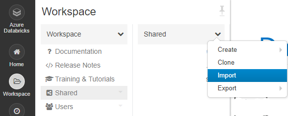
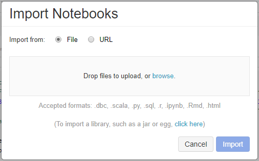

# MAG Subgraph Generation (PySpark)

In this sample, you generate subgraph using Microsoft Academic Graph (MAG) and specified paper ids on Azure Databricks.

## Prerequisites

Complete these tasks before you begin this tutorial:

* Setting up provisioning of Microsoft Academic Graph to an Azure blob storage account. See [Get Microsoft Academic Graph on Azure storage](https://docs.microsoft.com/academic-services/graph/get-started-setup-provisioning).

* Setting up Azure Databricks service. See [Set up Azure Databricks](https://docs.microsoft.com/academic-services/graph/get-started-setup-databricks).

## Gather the information that you need

   Before you begin, you should have these items of information:

   :heavy_check_mark:  The name of your Azure Storage (AS) account containing MAG dataset from [Get Microsoft Academic Graph on Azure storage](https://docs.microsoft.com/academic-services/graph/get-started-setup-provisioning.md#note-azure-storage-account-name-and-primary-key).

   :heavy_check_mark:  The access key of your Azure Storage (AS) account from [Get Microsoft Academic Graph on Azure storage](https://docs.microsoft.com/academic-services/graph/get-started-setup-provisioning.md#note-azure-storage-account-name-and-primary-key).

   :heavy_check_mark:  The name of the container in your Azure Storage (AS) account containing MAG dataset.

## Import PySparkMagClass shared notebook

In this section, you import PySparkMagClass.py as a shared notebook in Azure Databricks workspace. You will run this utility notebook from another notebook later.

1. Save **`PySparkMagClass.py`** in MAG dataset to local drive.

1. In the [Azure portal](https://portal.azure.com), go to the Azure Databricks service that you created, and select **Launch Workspace**.

1. On the left, select **Workspace**. From the **Workspace** > **Shared** drop-down, select **Import**.

    
    
1. Drag and drop PySparkMagClass.py to the **Import Notebook** dialog box.

    

1. Select **Import**. This will create a notebook with path `"/Shared/PySparkMagClass"`. No need to run this notebook.

   > [!NOTE]
   > When importing this notebook under **Shared** folder. The full path of this notebook is `"/Shared/PySparkMagClass"`. If you import it under other folders, note the actual full path and use it in following sections.

## Create new table contains specified paper ids
1. see [Databricks Tables](https://docs.databricks.com/data/tables.html)

## Run MagSubgraphGeneration notebook

In this section, you import MagSubgraphGeneration.py as a notebook in Azure Databricks workspace and run the notebook.

1. Save **`MagSubgraphGeneration.py`** in MAG dataset to local drive.

1. In Azure Databricks workspace portal, from the **Workspace** > **Users** > **Your folder** drop-down, select **Import**.

1. Drag and drop MagSubgraphGeneration.py to the **Import Notebook** dialog box.

1. Replace `<AzureStorageAccount>`, `<AzureStorageAccessKey>`, `<MagContainer>`, and `<OutputContainer>` placeholder values with the values that you collected while completing the prerequisites of this sample.

   |Value  |Description  |
   |---------|---------|
   |**`<AzureStorageAccount>`** | The name of your Azure Storage account. |
   |**`<AzureStorageAccessKey>`** | The access key of your Azure Storage account. |
   |**`<MagContainer>`** | The container name in Azure Storage account containing MAG dataset, usually in the form of **mag-yyyy-mm-dd**. |
   |**`<OutputContainer>`** | The container name in Azure Storage (AS) account where the output goes to. |

1. Rename `SubgraphDescription` 

1. Import `SpecifiedPaperIdsTable` (If you want example paper ids, please check [Official MAG/CORD-19 releases](https://github.com/microsoft/mag-covid19-research-examples/blob/master/src/data/releases.md))

1. Click **Run All** button. It could take 30 - 90 minutes to run on standard cluster. 

## Clean up resources

After you finish the tutorial, you can terminate the cluster. From the Azure Databricks workspace, select **Clusters** on the left. For the cluster to terminate, under **Actions**, point to the ellipsis (...) and select the **Terminate** icon.

If you don't manually terminate the cluster, it automatically stops, provided you selected the **Terminate after \_\_ minutes of inactivity** check box when you created the cluster. In such a case, the cluster automatically stops if it's been inactive for the specified time.

## Resources
* [Create an Azure Databricks service](https://azure.microsoft.com/services/databricks/)
* [Create a cluster for the Azure Databricks service](https://docs.azuredatabricks.net/user-guide/clusters/create.html)
* [Import this notebook and attach it to the cluster](https://docs.databricks.com/user-guide/notebooks/notebook-manage.html#import-a-notebook)
* [Official MAG/CORD-19 releases](https://github.com/microsoft/mag-covid19-research-examples/blob/master/src/data/releases.md)
