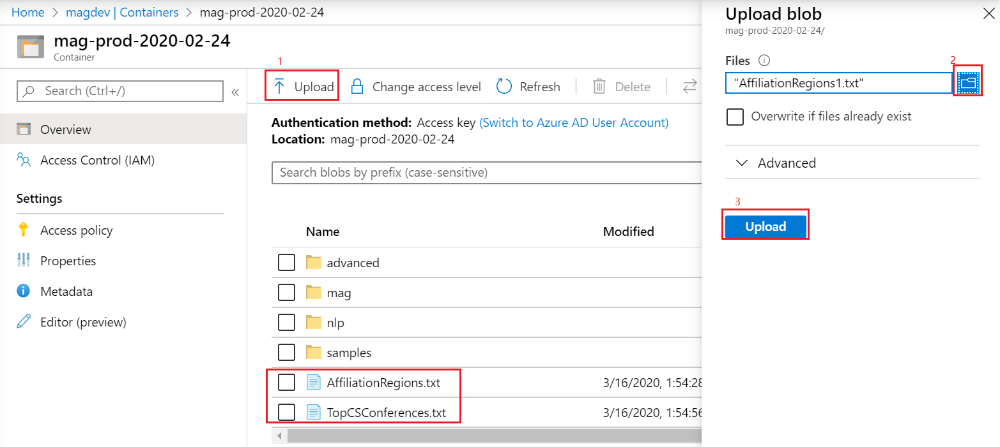
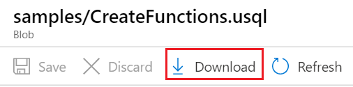
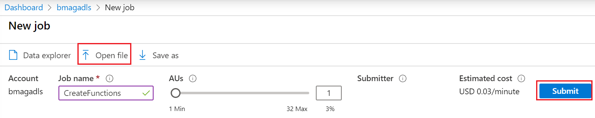
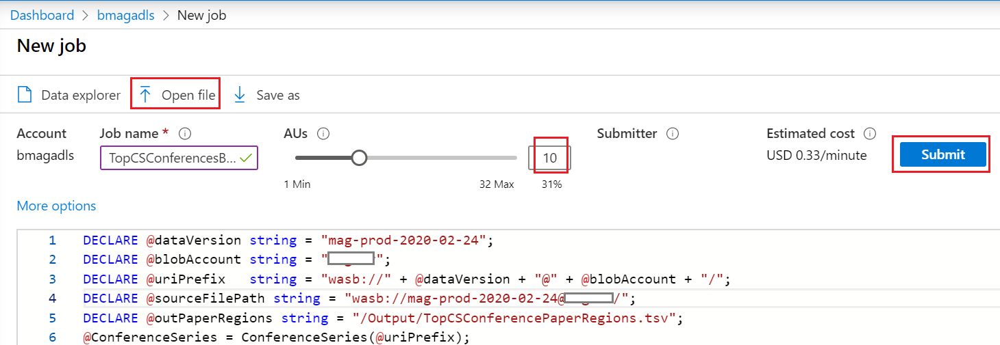
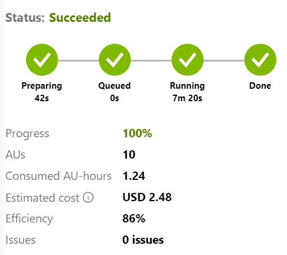

# Impact of COVID-19 on the Computer Science Research Community

Illustrates how the Microsoft Academic Graph is used to generate the data and graphs in the [Microsoft Academic Graph blog](https://www.microsoft.com/en-us/research/project/academic/articles/impact-of-covid-19-on-computer-science-research-community/). 

## Prerequisites
* [Set up provisioning of Microsoft Academic Graph to an Azure blob storage account](https://docs.microsoft.com/en-us/academic-services/graph/get-started-setup-provisioning?branch=index-build-commands-launch)
* [Set up Azure Data Lake Analytics for Microsoft Academic Graph](https://docs.microsoft.com/en-us/academic-services/graph/get-started-setup-azure-data-lake-analytics?branch=index-build-commands-launch)

## Gather the information that you need

Before you begin, you should have these items of information:

  :heavy_check_mark:  The name of your Azure Storage (AS) account containing MAG dataset from [Get Microsoft Academic Graph on Azure storage](get-started-setup-provisioning.md#note-azure-storage-account-name-and-primary-key).

   :heavy_check_mark:  The name of your Azure Data Lake Analytics (ADLA) service from [Set up Azure Data Lake Analytics](get-started-setup-azure-data-lake-analytics.md#create-azure-data-lake-analytics-account).

   :heavy_check_mark:  The name of your Azure Data Lake Storage (ADLS) from [Set up Azure Data Lake Analytics](get-started-setup-azure-data-lake-analytics.md#create-azure-data-lake-analytics-account).

   :heavy_check_mark:  The name of the container in your Azure Storage (AS) account containing MAG dataset.
   
## Upload the data that this analysis needed

1. Upload the list of 105 most impactful CS conferences to a Azure Storage, it can be the same storage containing MAG dataset.  Download  [TopCSConferences.txt](TopCSConferences.txt) to your local drive.   From [Azure portal](https://portal.azure.com), go to the Azure Storage account > **Containers > Upload > Select TopCSConferences.txt from your local drive > Upload**

 
 
2. The authors' affiliation locations are used as the paper locations. For your convenience, we included the affiliation-region mapping in [AffilicationRegions.txt](AffilicationRegions.txt). This file has all the affiliations involved in this analysis. Upload this file to the same location as TopCSConferences.txt.  If you wish to get more affiliations location, MAG Affiliation.txt contains latitude and longitude for each affiliation. You can use [Bing Map API](https://docs.microsoft.com/en-us/bingmaps/rest-services/locations/find-a-location-by-point) to get the region/country from the coordinates.

## Define functions to extract MAG and conference data

In prerequisite [Set up Azure Data Lake Analytics](get-started-setup-azure-data-lake-analytics.md), you added the Azure Storage (AS) created for MAG provision as a data source for the Azure Data Lake Analytics service (ADLA). In this section, you submit an ADLA job to create functions extracting MAG and conference data from Azure Storage (AS).

1. Download `samples/CreateFunctions.usql` to your local drive.   From [Azure portal](https://portal.azure.com), go to the Azure Storage account > **Containers > [mag-yyyy-mm-dd] > samples > CreateFunctions.usql > Download**.

   

2. Download [TopCSConf_CreateFunctions.usql](TopCSConf_CreateFunctions.usql) to your local drive.

3. Go to the Azure Data Lake Analytics (ADLA) service that you created, and select **Overview > New job > Open file**. Select `CreateFunctions.usql` in your local drive.   Select **Submit**.

   

1. The job should finish successfully.

   
   
1. Repeat step 3-4 with TopCSConf_CreateFunctions.usql.

## Count publications by region

In this section, you submit an ADLA job to count publications for each conference and region.

1. Download [TopCSConferencesByRegion.usql](TopCSConferencesByRegion.usql) to local drive.

1. Replace placeholder values in the script using the table below.

   |Value  |Description  |
   |---------|---------|
   |**`<MagContainer>`** | The container name in Azure Storage (AS) account containing MAG dataset, usually in the form of **mag-yyyy-mm-dd**. |
   |**`<AzureStorageAccount>`** | The name of your Azure Storage (AS) account containing MAG dataset. |
   |**`<SourceFileContainer>`** | The container name in Azure Storage (AS) account containing TopCSConferences.txt and AffilicationRegions.txt dataset. |
   |**`<SourceFileStorageAccount>`** | The name of your Azure Storage (AS) account containing TopCSConferences.txt and AffilicationRegions.txt dataset. |
   
1. In the [Azure portal](https://portal.azure.com), go to the Azure Data Lake Analytics (ADLA) service that you created, and select **Overview > New Job > Open file**.   Select **TopCSConferencesByRegion.usql** from your local drive.

1. Change **AUs** to 10, and select **Submit**.
  
  
  
1. The job should finish successfully in about 8 minutes.

  

## View output data

The output of the ADLA job in previous section goes to "/Output/TopCSConferencePaperRegions.tsv" in the Azure Data Lake Storage (ADLS). In this section, you use [Azure portal](https://portal.azure.com/) to view output content.
